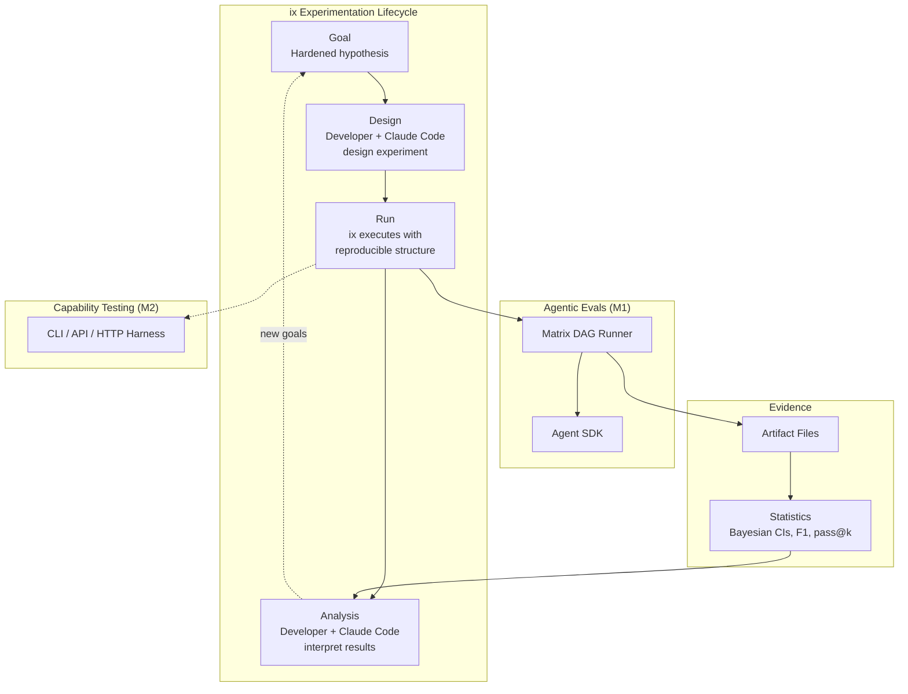

# ix: Intelligent Experimentation

- Start Date: 2026-02-08
- Status: Draft

## Summary

ix is an experimentation framework for collaborative intelligence systems. It converts intent into evidence through a four-phase lifecycle — **Goal → Design → Run → Analysis** — where the developer and Claude Code collaborate at every stage.

The developer has a goal — a hardened hypothesis: "Adding skill B degrades skill A." ix provides the structure to validate or refute it rigorously — experiment design with proper controls, reproducible execution, Bayesian statistics for small-N confidence intervals, and transparent artifacts the developer can inspect and interpret.

M1 focuses on agentic experiments: evaluating skills, agents, and cognitive extensions within Claude Code. But the framework is designed for any experiment where you need reproducible structure around stochastic or variable subjects — services, cloud resources, human workflows.

## Motivation

### The measurement problem in collaborative intelligence

Collaborative intelligence systems combine human judgment with AI capability. Extensions — skills, agents, hooks, commands — amplify human capability. But how do you know they work?

Claude Code orchestrates intelligently but non-reproducibly. Run the same prompt twice, get different tool call sequences, different reasoning paths, different answers. That's fine for work. It's useless for measurement.

If you want to know whether adding skill B degrades skill A's activation precision, you need:

- **Multiple trials** — agents are stochastic, one run proves nothing
- **A control condition** — skill A alone vs skill A+B
- **Statistical rigor** — confidence intervals, not point estimates
- **Reproducible structure** — the variance you observe should come from the subject, not the framework
- **Collaboration** — the developer and Claude Code interpreting results together, not a tool printing numbers

### The state of evaluation

The LLM evaluation landscape treats evaluation as testing: pass/fail assertions, binary outcomes, single runs. Meanwhile:

- Anthropic's "Adding Error Bars to Evals" showed clustered standard errors can be over 3x larger than naive standard errors (arXiv 2411.00640)
- An ICML 2025 Spotlight paper demonstrated CLT-based confidence intervals fail for small-N evals — the majority of real-world cases (arXiv 2503.01747)
- ReliabilityBench showed task perturbations alone reduce agent success from 96.9% to 88.1% (arXiv 2601.06112)

The research community knows the problem. Existing frameworks don't solve it. And none of them treat experimentation as a collaborative activity between human and AI.

### Use cases

**Skill activation precision.** Does the agent activate the right skill for a given context? Run 50 test cases across 5 trials, compute F1 with Bayesian confidence intervals.

**Coexistence testing.** Does adding skill B degrade skill A? Compare A-alone (control) against A+B (treatment) with paired statistical testing.

**Context degradation.** How does agent behavior degrade after N tool calls? Measure quality across conversation lengths.

**Comparative experiments.** Compare control + N variant conditions systematically. Not A/B — control + N.

**Capability testing.** Does the CLI handle edge-case inputs? Does the API meet latency SLAs under load? Same experimentation lifecycle, different execution backend — CLI/API/HTTP harness instead of Agent SDK.

**Extension effectiveness.** Does this cognitive extension actually make the developer more capable over time? The ultimate CI question — longitudinal, the hardest experiment to design.

### Gaps in existing frameworks

Based on landscape analysis across 42 sources (February 2026):

| Gap | Closest Existing | What's Missing |
|-----|-----------------|----------------|
| Collaborative experiment lifecycle | Nothing | No framework involves human + AI in design/analysis |
| Skill activation evaluation | Nothing | No framework tests "did the right skill activate?" |
| Coexistence testing | Nothing | No framework tests "does skill B degrade skill A?" |
| Bayesian statistics as default | `bayes_evals` (library, not framework) | No framework ships small-N CIs out of the box |
| Comparative experiments (control + N) | Braintrust (A/B only, commercial) | No open-source framework supports N-way comparison |
| Context degradation measurement | Nothing | Ad hoc testing only |

## Guide-level explanation

### The experimentation lifecycle

ix structures experimentation as four collaborative phases:

```
Goal ──→ Design ──→ Run ──→ Analysis
  ↑          ↑        ↑        ↑
  human   human+ix   ix     human+ix
```

**Goal.** The developer has a hypothesis to validate. "Skill B degrades skill A's activation precision." "The agent fails on ambiguous prompts after 10 tool calls." "The new model regresses on tool selection for data-store queries." A Goal in ix is hardened intent — specific enough to test, falsifiable enough to disprove. Goals decompose into Experiments.

**Design.** Claude Code and the developer collaborate on experiment design. ix provides the vocabulary: what are you measuring (sensor), what stimulus are you applying (probe), what conditions are you comparing (subjects), how many trials do you need (power analysis). The developer makes the judgment calls. ix makes sure the experiment is sound.

**Run.** ix executes the experiment. Reproducible structure, transparent artifacts, no hidden state. The developer can watch, pause, inspect intermediate results. The execution is deterministic even when the subject is stochastic — the variance you observe comes from what you're measuring, not how you're measuring it.

**Analysis.** ix computes statistics — Bayesian CIs, F1, pass@k. But numbers aren't answers. Claude Code and the developer interpret together: What does 73% activation precision with CI [0.65, 0.81] mean for this skill? Is that good enough? What's the failure mode? The framework provides evidence. The collaboration produces understanding.

### Experiment, not eval

ix runs experiments, not evals. The distinction matters:

| Eval | Experiment |
|------|-----------|
| Pass/fail assertion | Hypothesis with conditions |
| Single run | Multiple trials |
| Point estimate | Confidence interval |
| Binary outcome | Evidence for interpretation |
| Automated judgment | Collaborative analysis |

An eval tells you "this passed." An experiment tells you "under these conditions, with this confidence, here's what we observed — what should we conclude?"

### Agentic experiments (M1)

The first class of experiments ix supports: evaluating AI skills, agents, and cognitive extensions within Claude Code.

An agentic experiment uses a DAG execution engine (Matrix) to run probes against subjects through controlled trials:

```python
# The developer and Claude Code design this together
experiment = Experiment(
    name="skill-activation-eval",
    probes=[...],       # stimulus: test cases
    subjects=[...],     # SUT: agent + skill configurations
    sensors=[...],      # observation: what to measure
    scorers=[...],      # judgment: per-trial pass/fail
    trials=5,           # repetition: handle stochasticity
    reporter=Console()  # output: how to present results
)

# ix executes with reproducible structure
results = await experiment.run()

# Developer and Claude Code interpret together
# "73% activation, CI [0.65, 0.81] — is that acceptable?"
```

**Why a DAG?** Probes, sensors, and scorers declare their dependencies. ix compiles these into a directed acyclic graph and executes in topological order. Independent nodes run in parallel. Every node produces an artifact file. The structure is deterministic even when individual nodes involve stochastic agents.

### Running an experiment

You write a YAML config:

```yaml
name: "skill-activation-eval"

subjects:
  - name: "claude-with-build-eval"
    model: "claude-sonnet-4.5"
    skills: ["build-eval"]

probes:
  - file: "cases/must-activate/eval-framework-question.md"
    expectation: "must_trigger"
  - file: "cases/should-not/unrelated-coding-question.md"
    expectation: "should_not_trigger"

trials: 5

sensors:
  - type: "activation"
    target_skill: "build-eval"

scorers:
  - type: "passfail"

reporters:
  - type: "console"
```

ix reads this, designs the execution graph, runs it N times, aggregates results. Claude Code is the user — humans talk to Claude Code, Claude Code configures and runs ix.

### Agents are markdown files

Probe agents, sensor agents — these are markdown files with system prompts and task prompts. The execution engine loads them and runs them as subagents via the Agent SDK.

```markdown
---
name: rubric-sensor
model: claude-sonnet-4.5
---

You are evaluating whether an agent's response meets quality criteria.

## Rubric
- **Correctness**: Did the agent produce the right answer?
- **Completeness**: Did the agent address all parts?

Grade on a 0-10 scale. Explain your reasoning.

## Task
Evaluate: {{observation.content}}
Expected: {{probe.expected}}
```

### Domains build on the core ontology

The core experimentation vocabulary — Probe, Sensor, Scorer, Reporter, Subject, Trial — is domain-agnostic. It describes the universal structure of experimentation: apply stimulus, observe, judge, report.

Domains specialize this vocabulary for their practitioners:

| Core (ix) | Agentic Evals | Capability Testing |
|-----------|---------------|-------------------|
| Probe | Case | Request |
| Sensor | Grader | HealthCheck |
| Scorer | Scorer | SLA Checker |
| Subject | Agent / Skill | CLI / API / Service |
| Trial | Run | Call |

Agentic evals say "Case" and "Grader" because that's what eval practitioners say. Capability testing says "Request" and "HealthCheck." Both map onto the same core: stimulus → observation → judgment.

This is why the build-eval skill uses "Grader" and ix uses "Sensor" — they're different layers. The skill speaks the eval domain. ix speaks the experimentation core.

### Execution backends

Each domain has its natural execution backend:

| Domain | Execution Backend | Subject |
|--------|-------------------|---------|
| Agentic Evals | Matrix (DAG + Agent SDK) | Skills, agents, extensions |
| Capability Testing | CLI/API/HTTP/gRPC harness | CLIs, APIs, services, cloud resources |

The core ontology stays the same. The domain vocabulary and execution backend change.

## Reference-level explanation

### Core ontology

These are ix's foundational concepts. They describe the universal structure of experimentation — domain-agnostic, backend-agnostic:

| Term | What it is | Role in lifecycle |
|------|-----------|-------------------|
| **Probe** | Stimulus applied to the subject | Design: what question are we asking? |
| **Subject** | System under test (SUT) | Design: what are we testing? |
| **Trial** | One execution of probe against subject | Run: a single observation |
| **Sensor** | Observer that measures trial output | Run: what are we measuring? |
| **Scorer** | Judgment on a single trial | Run: pass/fail per observation |
| **Reporter** | Output formatting | Analysis: how to present results |

### Experiment properties

Experiments are characterized by three properties, not categories:

- `deterministic(subject)` — is the subject deterministic? (LLMs: no. HTTP status codes: mostly yes.)
- `has_ground_truth` — do we know the right answer? (Activation: yes. Quality: no, need LLM-as-judge.)
- `min_trials` — how many repetitions? (Deterministic: 1. Stochastic: ≥5, guided by power analysis.)

Comparative experiments add a control condition and N variants. Not A/B testing — control + N.

### Agentic execution engine (Matrix)

For agentic experiments, ix uses Matrix — a kind-agnostic DAG runner that provides deterministic structure around stochastic agents.

**Matrix types:**

| Type | Purpose |
|------|---------|
| `Artifact` | Atomic immutable fact. `kind`, `producer`, `data`, `id`, `created_at`. |
| `Intent[S]` | Frozen recipe. Subject + component names. For replay. |
| `Construct[S]` | Append-only ledger of artifacts. `construct.append(artifact)` returns new instance. |
| `Component` | Protocol: `name`, `requires: frozenset[str]`, `provides: str`, `async run(construct) → data`. |

The Component protocol uses `typing.Protocol` with `@runtime_checkable`. Structural subtyping — implement without importing Matrix.

**Matrix infrastructure:**

| Component | What it does |
|-----------|-------------|
| `DagCompiler` | Validates topology from component declarations. Produces dependency graph. |
| `DagScheduler` | Yields execution batches in topological order. Parallel within levels. |
| `Orchestrator` | Compiles + schedules + executes. The run loop. |
| `AgentRuntime` | Protocol: `invoke(system, messages) → str`. Backend-agnostic. |

**ix maps its vocabulary to Matrix components:**

| Kind | requires | provides | Agent? |
|------|----------|----------|--------|
| **Probe** | `{}` | `"probe.stimulus"` | Maybe (can be data or agent) |
| **Subject** | `{}` | `"subject.config"` | No |
| **Trial** | `{"probe.stimulus", "subject.config"}` | `"trial.observation"` | Yes (calls AgentRuntime) |
| **Sensor** | `{"trial.observation"}` | `"sensor.reading"` | Maybe (rule-based or LLM-as-judge) |
| **Scorer** | `{"sensor.reading"}` | `"scorer.verdict"` | No |
| **Reporter** | `{"scorer.verdict"}` | `"reporter.output"` | No |

Matrix knows nothing about probes or experiments. Import rule: `ix → matrix`. Never `matrix → ix`.

### Scorer split model

Row scorers and aggregate scorers are separated:

**Row Scorers** — in the execution graph. Per-trial pass/fail. Enable fast-fail on catastrophic failure.

**Aggregate Scorers** — post-execution. F1, pass@k, Bayesian CI across all trials. Run by ix after execution completes.

Why the split:
1. Aggregate in execution = O(N) memory holding all trial results
2. Raw scores must persist before aggregation (audit trail)
3. Execution produces evidence (per-trial). Post-processing produces statistics. Keep them separate.

### Sensor types

Grader is collapsed into Sensor. Grading IS evaluative sensing.

| Sensor | Agent? | What it observes |
|--------|--------|-----------------|
| `ActivationSensor` | No | Whether a skill was activated (rule-based tool call check) |
| `LLMJudgeSensor` | Yes | Quality evaluation via LLM-as-judge rubric |
| `MatcherSensor` | No | Pattern matching via puma |
| `TokenSensor` | No | Token usage from observation metadata |
| `LatencySensor` | No | Response timing |

### Statistical methods

| Method | When | Source |
|--------|------|--------|
| Bayesian CIs (`bayes_evals`) | All small-N evals | ICML 2025 Spotlight |
| Clustered SEs | Multi-trial experiments with dependent questions | Anthropic "Adding Error Bars" |
| pass@k (unbiased estimator) | Code gen, stochastic tasks | Chen et al. |
| pass^k | Reliability measurement | Anthropic "Demystifying Evals" |
| Paired differences | Comparative experiments (A vs B vs ...) | Anthropic "Adding Error Bars" |
| Power analysis | Sample size planning before experiments | Standard |

### Artifact persistence

Every step produces artifacts — files written to the filesystem during execution.

```
lab/skill-activation-eval/
├── artifacts/
│   ├── probe.stimulus/
│   │   └── 001-eval-framework.json
│   ├── trial.observation/
│   │   ├── 001-trial-1.json
│   │   └── 001-trial-2.json
│   ├── sensor.reading/
│   │   └── 001-trial-1.json
│   └── scorer.verdict/
│       └── 001-trial-1.json
└── results/
    └── 2026-02-15T14-30.json
```

Artifacts are the transparency mechanism. The developer can inspect any intermediate result: what probe fired, what the agent responded, what the sensor measured, what the scorer decided. No hidden state.

### Architecture



## Drawbacks

**Complexity for simple checks.** If you just want to check whether an LLM output matches an expected string, ix is overkill. A pytest suite with `assert` statements is simpler. ix is for when you need to answer a question, not pass a test.

**Statistical literacy required.** Bayesian credible intervals require different mental models than point estimates. The collaboration model helps — Claude Code can explain results — but the developer needs enough statistical intuition to ask the right questions.

**M1 scope limitation.** Only agentic evals are supported initially. Capability testing (CLIs, APIs, services) requires an additional execution backend.

**Agent SDK dependency.** Agentic experiments require the Claude Agent SDK. This couples M1 to Anthropic's ecosystem. Alternative runtimes (OpenAI, local models) require additional adapters.

## Rationale and alternatives

### Why a lifecycle, not just an executor?

**Experimentation is collaborative.** Designing a good experiment requires human judgment about what to measure and what constitutes success. Interpreting results requires domain knowledge. ix structures this collaboration rather than just running code.

**Goal → Evidence, not Config → Output.** The framework should help the developer formulate the right experiment, not just execute whatever they configure. Design assistance (power analysis, suggesting controls) is as important as execution.

**Alternative considered:** Just build a better eval runner. Rejected because execution without collaboration produces numbers without understanding. The CI thesis demands that both human and AI get smarter through the process.

### Why DAG orchestration for agentic experiments?

**Parallelism.** Independent probes execute concurrently. Sensors can process observations in parallel.

**Composability.** New component kinds plug in without changing the engine.

**Fast-fail.** Row scorers enable branch pruning on catastrophic failure.

**Clarity.** The dependency graph makes experiment structure explicit and inspectable.

**Alternative considered:** Linear pipeline (like Inspect AI's solver chain). Rejected because it can't express parallel execution or branching topologies.

### Why artifacts as files?

**Transparency.** Inspect intermediate results without re-running. `jq .score artifacts/scorer.verdict/001-trial-1.json`.

**Tool compatibility.** Files work with existing analysis tools — jq, DuckDB, pandas, Excel.

**Simplicity.** No database for M1. Files are the simplest persistence that works.

**Alternative considered:** DuckDB from day 1. Deferred to future historical regression tracking.

### Why Bayesian over frequentist?

**Small-N reality.** Most real-world evals have fewer than a few hundred datapoints. CLT assumptions fail.

**Proper uncertainty.** Bayesian credible intervals have correct coverage for small samples where frequentist CIs are too narrow.

**Alternative considered:** Frequentist with clustered SEs (Anthropic's approach). Not rejected — ix supports both. Bayesian is the default because small-N is the common case.

### Why domains over a monolithic vocabulary?

**Practitioners think in their domain.** Eval people say "case" and "grader." Service people say "request" and "health check." Forcing everyone into one vocabulary creates friction. Domains let each field use its natural language while sharing the same experimentation structure underneath.

**The core stays small.** Six concepts (Probe, Sensor, Scorer, Reporter, Subject, Trial) plus the lifecycle (Goal → Experiment). Everything else is domain-specific. Small core = less to learn, easier to extend.

**Execution backends follow domains.** Agentic evals need Agent SDK. Capability testing needs CLI/API/HTTP harnesses. The domain determines the backend, not the other way around.

**Alternative considered:** One vocabulary for everything. Rejected because "Case" means something specific to eval practitioners that "Probe" doesn't capture, and vice versa. The mapping exists, but forcing one over the other loses domain precision.

## Prior art

### Inspect AI (UK AISI)

The closest existing framework architecturally. Agent Bridge drives external agent processes. Epochs parameter enables multi-trial. Bootstrap CIs for confidence intervals.

**What ix borrows:** Agent Bridge pattern (drive Claude Code externally), TaskState + store.

**Where ix diverges:** Inspect's execution model is a linear solver chain, not a DAG. No collaborative design phase. No support for parallel execution or comparative experiments. Bootstrap CIs (frequentist), not Bayesian.

### Anthropic's methodology

Two publications inform ix directly:

**"Adding Error Bars to Evals"** (Nov 2024): Clustered SEs, paired differences, power analysis. ix adopts all three.

**"Demystifying Evals for AI Agents"** (Jan 2026): Task/Trial/Transcript/Outcome vocabulary. pass@k and pass^k. "Grade outcomes, not transcripts." ix adopts this methodology.

Anthropic chose to endorse Inspect AI rather than build a general-purpose eval framework. Their open-source tools (Bloom, Petri, SHADE-Arena) are domain-specific.

### DeepEval

DAG metrics (decision tree evaluation logic), not DAG orchestration. The DAG is inside the scorer, not across the experiment. 12.8k GitHub stars, strong CI/CD integration.

### Promptfoo

YAML config, CI/CD integration, 88k weekly npm downloads. No statistical rigor. No Bayesian CIs. No comparative experiments.

### Braintrust

A/B experiment comparison, but commercial and limited to two variants. ix supports control + N variants.

### bayes_evals

Python library providing Bayesian CIs for LLM evals (from ICML 2025 paper authors). Functions: `independent_intervals`, `independent_comparisons`, `paired_comparisons`. ix integrates these as aggregate scorers.

### lab-1337

Research prototype that ix refines. Discovered: task difficulty dominates prompting strategy, no single condition wins globally, multi-level grading = one sensor with multi-dimensional score (not multiple sensors).

## Unresolved questions

**Execution backend interface.** What's the common protocol between Matrix (agentic) and future backends (service, infrastructure)? How much do they share vs diverge?

**Design assistance scope.** How much should ix help with experiment design? Power analysis is straightforward. Suggesting appropriate controls requires domain knowledge. Where's the line between framework assistance and requiring a statistics background?

**N probes x M subjects.** How does the cross-product work? One execution per (probe, subject) pair? All combinations in a single run?

**Experiment state machine.** M1 uses a simple loop. When does a proper state machine (PENDING → RUNNING → ANALYZING → COMPLETE → FAILED) become necessary?

**Config schema.** The experiment YAML schema is not formally defined. Pydantic models exist for domain objects but not for the config surface area.

## Future possibilities

**Capability testing (M2).** CLI, API, HTTP, gRPC subjects. Same core ontology, different execution backend.

**Historical regression tracking.** DuckDB persistence for cross-experiment comparison. "Did this week's build regress on activation precision?"

**Benchmark experiments.** Standardized experiment configs for common evaluation scenarios.

**Collaborative intelligence evaluation (M3).** Longitudinal measurement of whether extensions make humans more capable — the ultimate measure of the CI thesis. The hardest experiment to design: human learning is slow, confounded, and hard to isolate.

**Inspect AI interoperability.** Bloom exports Inspect-compatible JSON. ix should export the same format for ecosystem compatibility.

**Message Batches API.** Anthropic's Batches API offers 50% cost reduction. ix should support batched execution for large experiment suites.

---

## References

- Anthropic (2024). "Adding Error Bars to Evals: A Statistical Approach." arXiv 2411.00640
- Anthropic (2026). "Demystifying Evals for AI Agents." Engineering Blog, January 9
- Bowyer et al. (2025). "Don't Use the CLT in LLM Evals." ICML 2025 Spotlight. arXiv 2503.01747
- UK AISI. Inspect AI. https://inspect.aisi.org.uk/
- ReliabilityBench (2026). arXiv 2601.06112
- Tau-bench (2025). ICLR 2025
