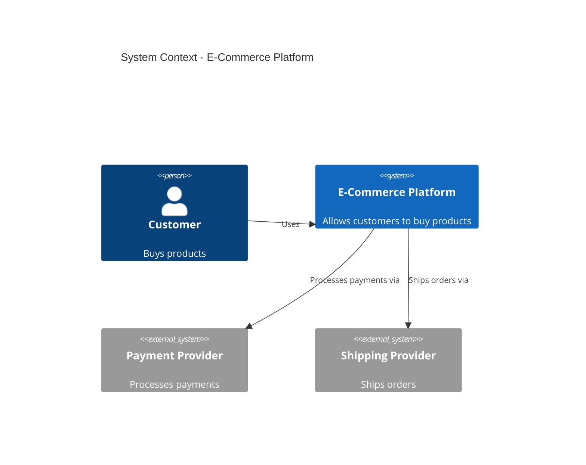
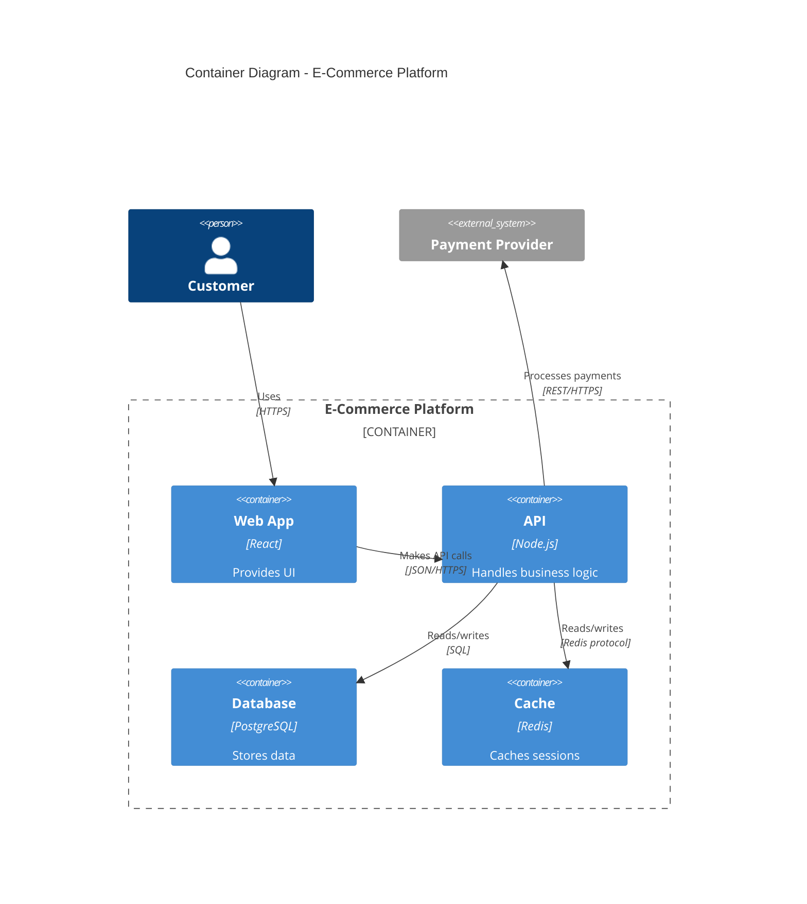

# C4 Model for Architecture Diagrams

C4 (Context, Container, Component, Code) model for software architecture documentation.

## Level Selection

| Level | Audience | Shows | Tool Choice |
|-------|----------|-------|-------------|
| **Context** | Everyone (business + tech) | System boundary, users, external systems | Mermaid `C4Context` or C4-PlantUML |
| **Container** | Technical stakeholders | Apps, databases, communication | Mermaid `C4Container` or C4-PlantUML |
| **Component** | Developers | Components within container | C4-PlantUML (Mermaid less suitable) |
| **Code** | Developers (specific module) | Classes, interfaces | UML `classDiagram` or IDE |

**Most teams only need Context + Container diagrams.**

## Mermaid C4 Syntax

### Context Diagram (Level 1)


### Container Diagram (Level 2)


## C4-PlantUML (For Serious C4 Work)

**Why**: Production-proven, automatic layout, standardized sprites, better for complex diagrams

```plantuml
@startuml
!include https://raw.githubusercontent.com/plantuml-stdlib/C4-PlantUML/master/C4_Context.puml

LAYOUT_WITH_LEGEND()

title System Context - E-Commerce Platform

Person(customer, "Customer", "Buys products")
System(ecommerce, "E-Commerce Platform", "Web and mobile apps")
System_Ext(payment, "Payment Provider", "Stripe")

Rel(customer, ecommerce, "Uses")
Rel(ecommerce, payment, "Processes payments")
@enduml
```

**Requires**: Java + GraphViz (`brew install plantuml graphviz`)

## When to Use C4 vs Other Diagrams

| Need | Use C4 | Use Instead |
|------|--------|-------------|
| Show system boundary | Context | Architecture diagram |
| Show tech stack | Container | Architecture diagram |
| Show component details | Component | Class diagram |
| Show API interactions | No | Sequence diagram |
| Show state transitions | No | State diagram |
| Show data model | No | ER diagram |

**C4 is for structure, not behavior.**

## C4 Best Practices

- **One system per Context diagram** — don't try to show everything
- **One container per Component diagram** — drill down into specific parts
- **Skip levels you don't need** — Context + Container often sufficient
- **Meaningful names** — "Payment Service" not "Service A"
- **Relationship labels** — "Processes payments" not "Uses"
- **Update regularly** — C4 diagrams live in git alongside code

## Mermaid C4 vs C4-PlantUML

| | Mermaid C4 | C4-PlantUML |
|---|-----------|-------------|
| GitHub rendering | Native | Requires pre-rendering |
| Build step | None | Java + GraphViz |
| Sprites/icons | No | Yes |
| Complex diagrams | Awkward | Natural |
| **Best for** | Simple Context/Container in GitHub | Serious architecture documentation |

## Decision Matrix

| Situation | Tool Choice |
|-----------|-------------|
| Quick GitHub docs, simple architecture | Mermaid `C4Context` / `C4Container` |
| Complex enterprise architecture | C4-PlantUML |
| Need beautiful layouts, willing to build | D2 (C4-inspired, not strict C4) |
| Formal C4 compliance required | C4-PlantUML |

---

**Sources**: C4 model official docs (c4model.com), C4-PlantUML documentation, LINE Engineering blog
