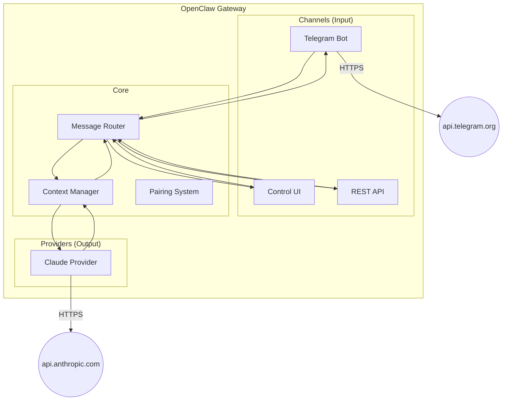
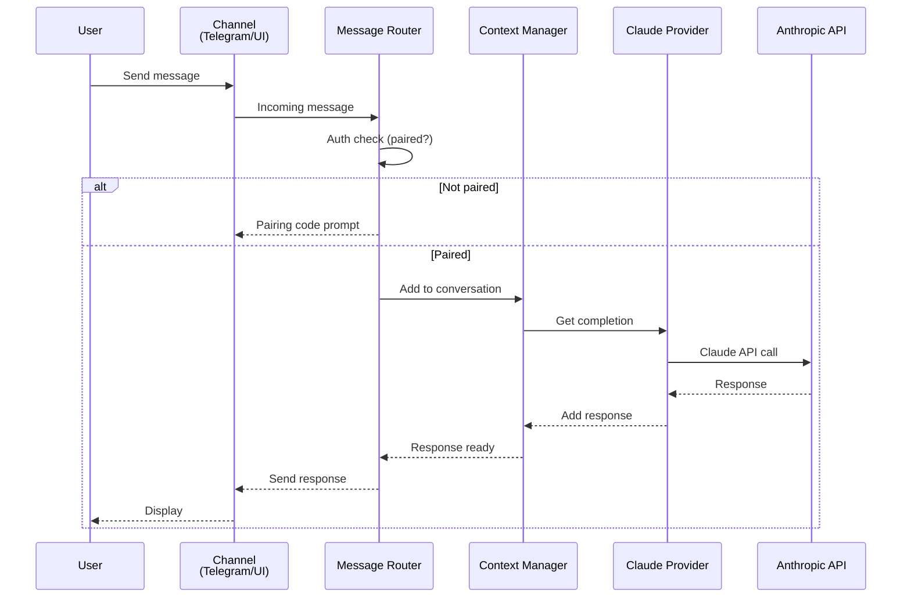
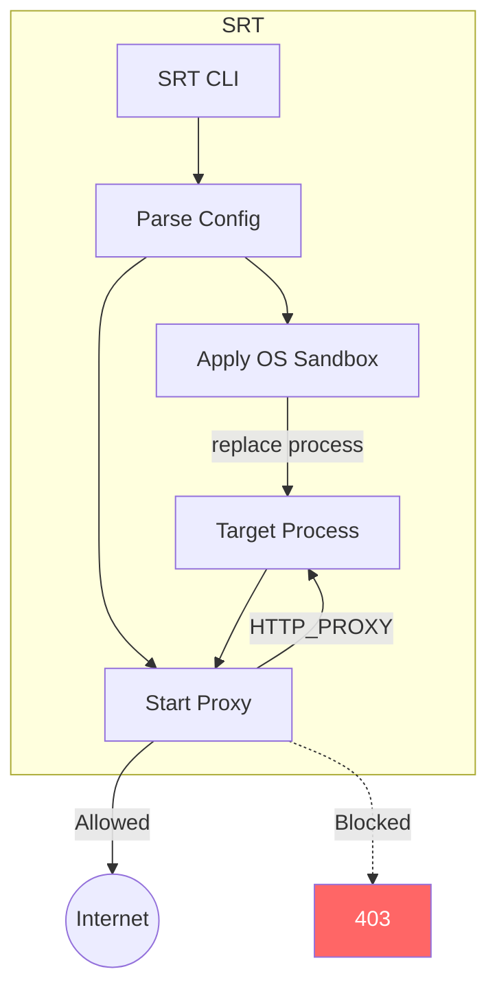
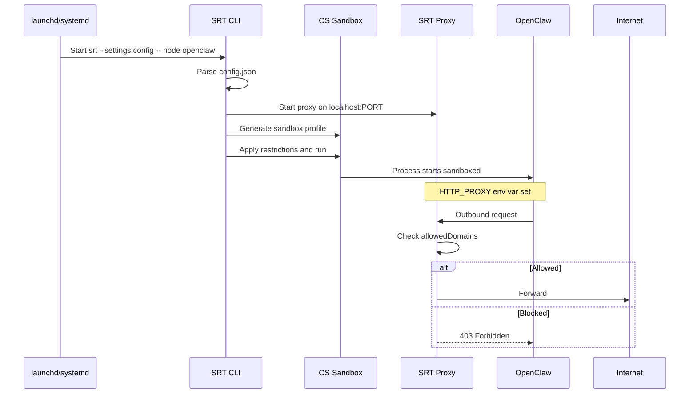
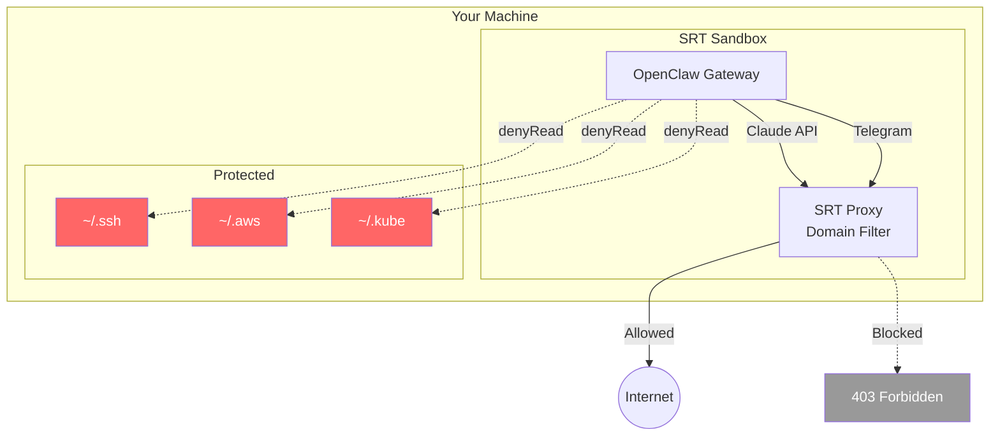
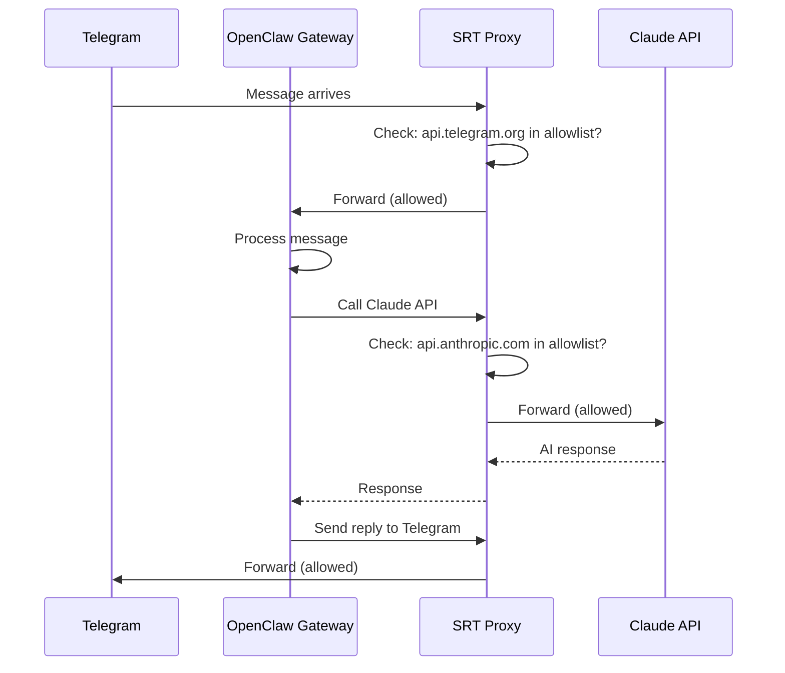
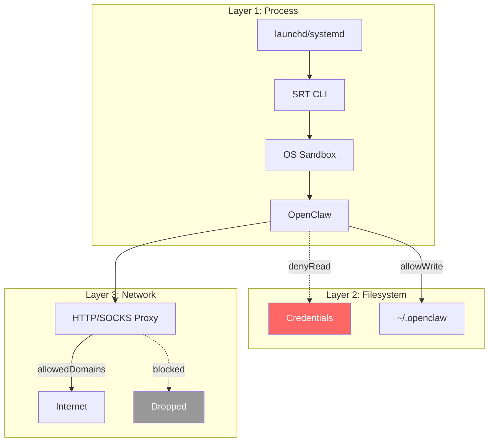
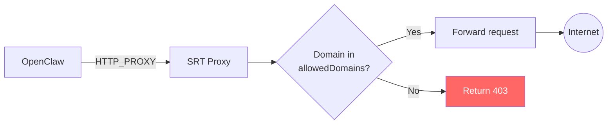
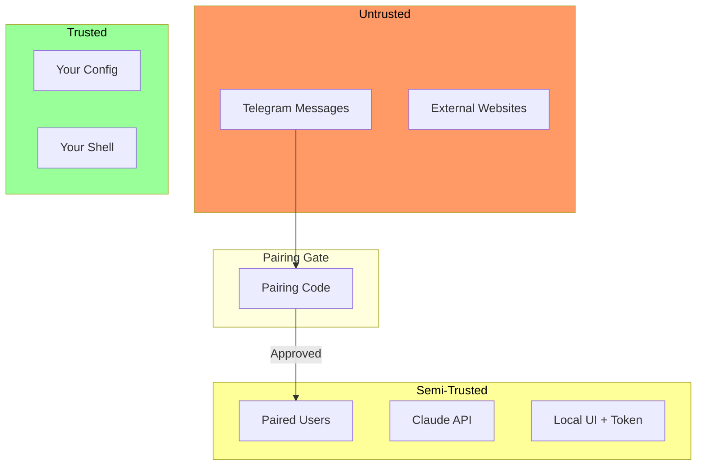
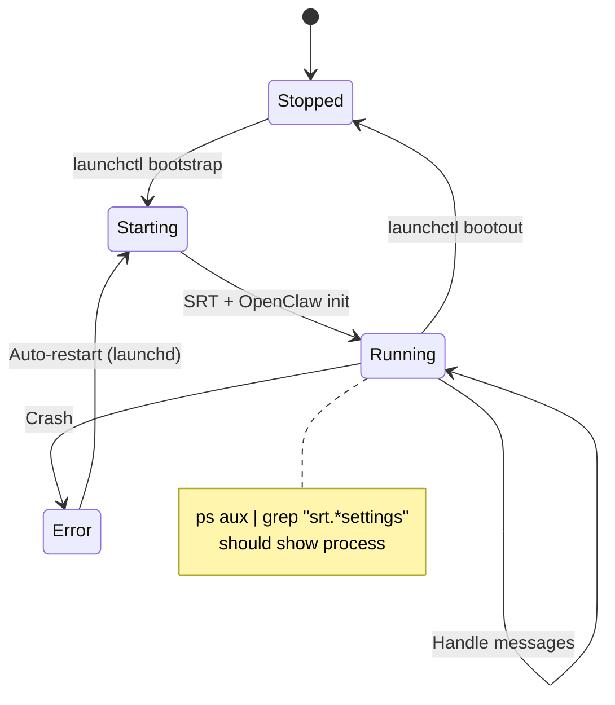

# OpenClaw + SRT Architecture

**What this explains:** How OpenClaw and SRT work together to provide secure AI assistance.

**Reading guide:**
- **Just starting?** Read "The Big Picture" and "Why This Architecture?"
- **Understanding OpenClaw?** Read "OpenClaw Architecture" section
- **Understanding SRT?** Read "SRT Architecture" and "How SRT Applies Restrictions"
- **Understanding integration?** Read "Combined: OpenClaw + SRT"
- **Deep dive?** Read all diagrams in sequence

---

## The Big Picture

Two systems, distinct responsibilities:

| System | Purpose | Runs As |
|--------|---------|---------|
| **OpenClaw** | Personal AI assistant | Node.js daemon |
| **SRT** | Security sandbox wrapper | Process wrapper |

Without SRT, OpenClaw has full access to your machine. SRT restricts what it can reach.

**In brief:**
- OpenClaw handles communication (Telegram, web UI, Claude API)
- SRT enforces security (network filtering, filesystem restrictions)
- They compose via process wrapping: `srt -- node openclaw`

---

## OpenClaw Architecture

OpenClaw is a modular gateway connecting you to Claude.



### OpenClaw Components

**Channels** - How users interact with OpenClaw:

| Channel | Transport | Auth |
|---------|-----------|------|
| Telegram | Bot API polling | Pairing code |
| Control UI | HTTP localhost | Bearer token |
| REST API | HTTP localhost | Bearer token |

**Core** - Message orchestration:

| Component | Responsibility |
|-----------|----------------|
| Message Router | Dispatches to/from channels |
| Context Manager | Maintains conversation state |
| Pairing System | Links Telegram users to instance |

**Providers** - AI backends:

| Provider | Purpose |
|----------|---------|
| Claude | Primary AI (Anthropic API) |

### OpenClaw Message Flow



### OpenClaw Configuration

Config lives at `~/.openclaw/openclaw.json`:

```
~/.openclaw/
├── openclaw.json      # Main config
├── credentials/       # API keys (encrypted)
├── logs/              # Gateway logs
└── state/             # Conversation state
```

Key config sections:

| Section | Controls |
|---------|----------|
| `providers.anthropic` | API key, model selection |
| `channels.telegram` | Bot token, DM policy |
| `gateway.auth` | UI token, port |

---

## SRT Architecture

SRT wraps any process to apply OS-level security restrictions.



### SRT Components

| Component | macOS | Linux |
|-----------|-------|-------|
| OS Sandbox | sandbox-exec + Seatbelt | bubblewrap (bwrap) |
| Network Proxy | HTTP/SOCKS proxy | HTTP/SOCKS proxy |
| Config Format | JSON | JSON |

### How SRT Applies Restrictions



---

## Combined: OpenClaw + SRT



### Complete Message Flow

When you send a message via Telegram:



---

## SRT Sandbox Layers

SRT provides defense in depth through multiple layers:



### Layer Details

| Layer | macOS | Linux | What it does |
|-------|-------|-------|--------------|
| Process | sandbox-exec | bubblewrap | OS-level isolation |
| Filesystem | Seatbelt rules | Bind mounts | Path restrictions |
| Network | Proxy filtering | Namespace + proxy | Domain allowlist |

---

## Network Filtering Flow

The proxy intercepts all HTTP/HTTPS traffic:



### Domain Matching

```
Pattern: *.linkedin.com
  ✓ Matches: www.linkedin.com, api.linkedin.com
  ✗ Does NOT match: linkedin.com (no subdomain)

Solution: Include both
  "linkedin.com",
  "*.linkedin.com"
```

---

## Trust Boundaries



---

## Daemon Lifecycle



---

## Why This Architecture?

### Why Proxy-Based Network Filtering?

**Problem:** Seatbelt (macOS sandbox) network rules are IP-based, not domain-based.

**Challenges with IP filtering:**
- IPs change (CDNs, load balancers)
- Multiple domains share IPs
- DNS is dynamic

**Solution:** Proxy intercepts requests and checks the Host header / SNI.

### Why Process Replacement?

`sandbox-exec` uses the POSIX `exec` pattern - applies restrictions then replaces itself with the target process.

**Benefits:**
- Clean process tree (no visible wrapper)
- Restrictions persist at kernel level
- Minimal overhead

**Consequence:** You won't see `sandbox-exec` in `ps` output. The sandbox IS active - it's kernel-enforced, not process-enforced.

### Why the `--` Separator?

SRT uses Commander.js for CLI parsing. Without `--`, flags in the wrapped command get interpreted as SRT flags.

```
BAD:  srt --settings config curl -s https://...
      └── Commander sees -s as --settings short flag

GOOD: srt --settings config -- curl -s https://...
      └── Everything after -- is the command
```

The patch script handles this automatically.

---

## Further Reading

- [methodology.md](methodology.md) - Why sandbox OpenClaw
- [security-model.md](../../skills/openclaw-srt-setup/references/security-model.md) - What's protected and why
- [gotchas.md](../../skills/openclaw-srt-setup/references/gotchas.md) - Common issues
- [sources.md](sources.md) - Primary references
