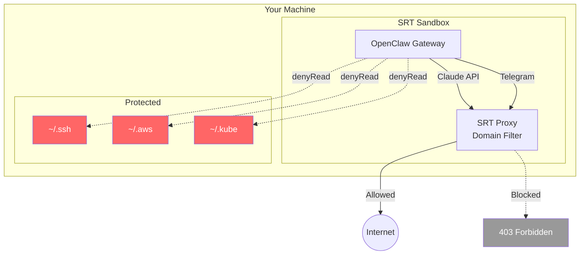
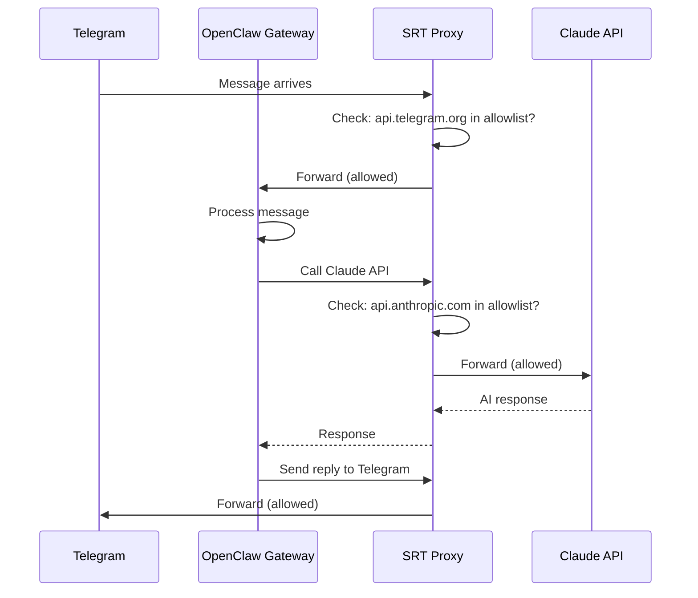
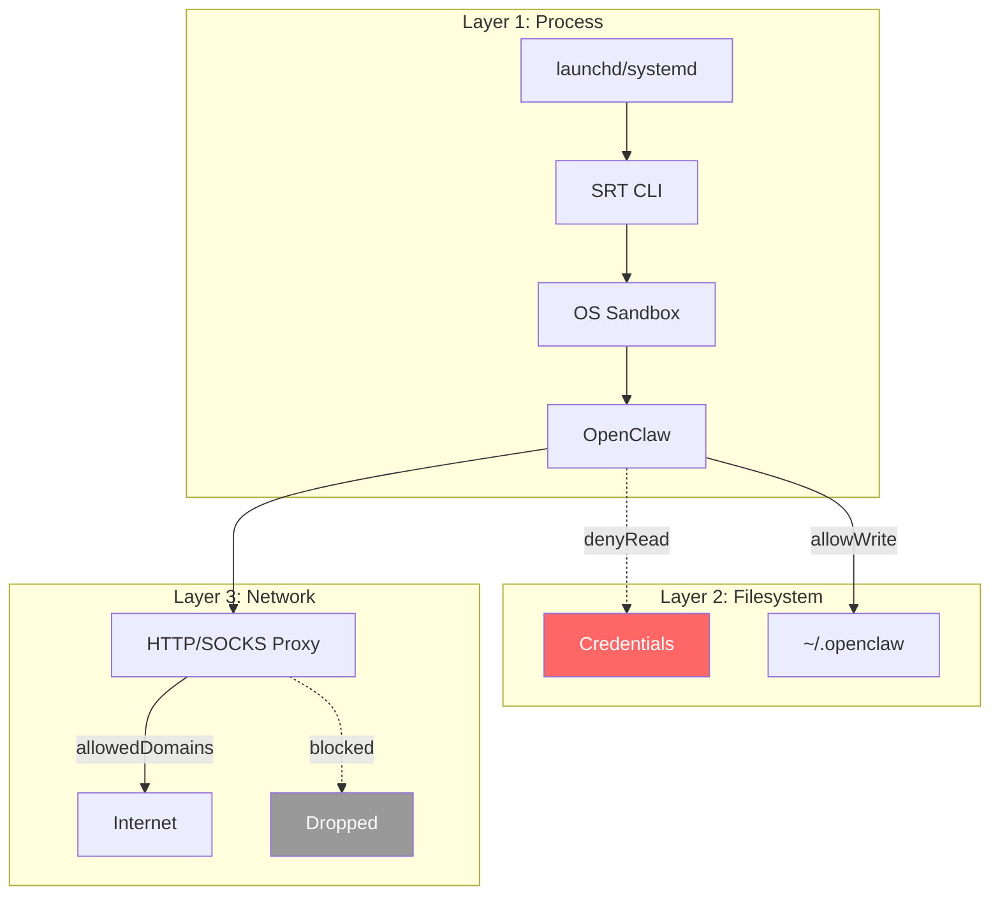
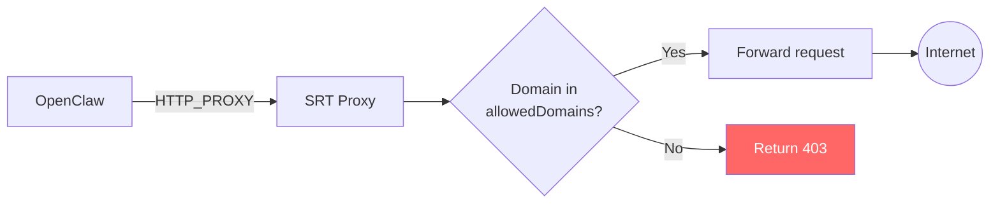
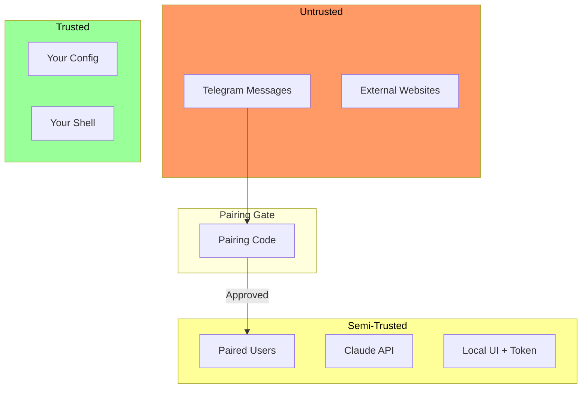
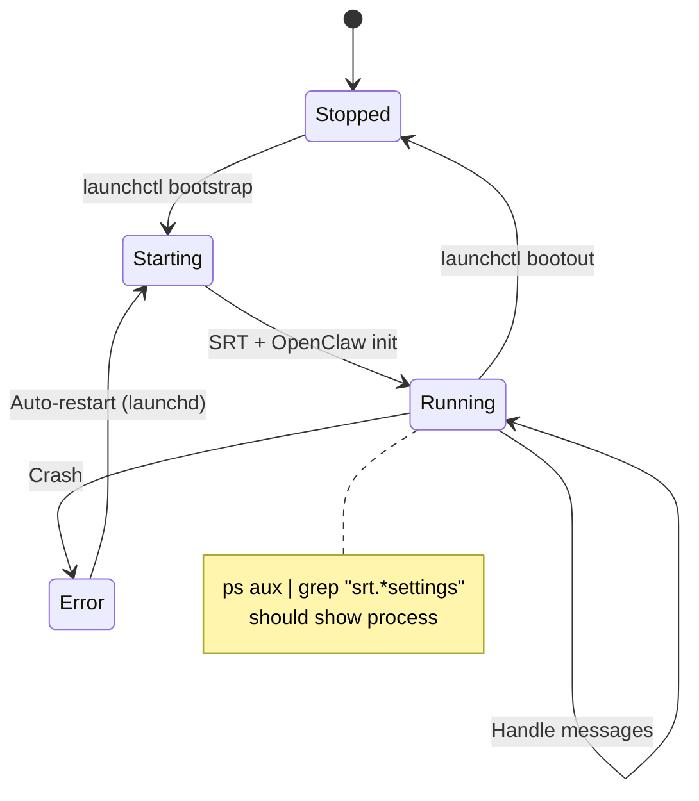

# OpenClaw + SRT Architecture

How the pieces fit together.

## The Big Picture

OpenClaw is a personal AI assistant that runs as a daemon on your machine. It connects to:
- **Claude API** for AI responses
- **Telegram** for mobile messaging
- **Local UI** for direct interaction

Without sandboxing, this daemon has full access to your machine — files, network, everything.

SRT (Sandbox Runtime) wraps OpenClaw to restrict what it can access.



## Component Flow

When you send a message via Telegram:



## SRT Sandbox Layers

SRT provides defense in depth through multiple layers:



### Layer Details

| Layer | macOS | Linux | What it does |
|-------|-------|-------|--------------|
| Process | sandbox-exec | bubblewrap | OS-level isolation |
| Filesystem | Seatbelt rules | Bind mounts | Path restrictions |
| Network | Proxy filtering | Namespace + proxy | Domain allowlist |

## Network Filtering Flow

The proxy intercepts all HTTP/HTTPS traffic:



### Domain Matching

```
Pattern: *.linkedin.com
  ✓ Matches: www.linkedin.com, api.linkedin.com
  ✗ Does NOT match: linkedin.com (no subdomain)

Solution: Include both
  "linkedin.com",
  "*.linkedin.com"
```

## Trust Boundaries



## State Diagram: Daemon Lifecycle



## Why This Architecture?

### Why proxy-based network filtering?

**Problem**: Seatbelt (macOS sandbox) does IP-based filtering, not domain-based.

**Challenge**:
- IPs change (CDNs, load balancers)
- Multiple domains share IPs
- DNS is dynamic

**Solution**: Proxy intercepts requests and checks the Host header / SNI.

### Why process replacement?

`sandbox-exec` uses the POSIX `exec` pattern — it replaces itself with the target process after applying restrictions.

**Benefits**:
- Clean process tree (no wrapper visible)
- Restrictions persist at kernel level
- Minimal overhead

**Consequence**: You won't see `sandbox-exec` in `ps` output. The sandbox IS active — it's enforced by the kernel, not a running process.

### Why the `--` separator?

SRT uses Commander.js for CLI parsing. Without `--`, flags in the wrapped command get interpreted as SRT flags.

```
BAD:  srt --settings config curl -s https://...
      └── Commander sees -s as --settings short flag

GOOD: srt --settings config -- curl -s https://...
      └── Everything after -- is the command
```

## Further Reading

- [security-model.md](../../skills/openclaw-srt-setup/references/security-model.md) — What's protected and why
- [gotchas.md](../../skills/openclaw-srt-setup/references/gotchas.md) — Common issues
- [sources.md](sources.md) — Primary references
