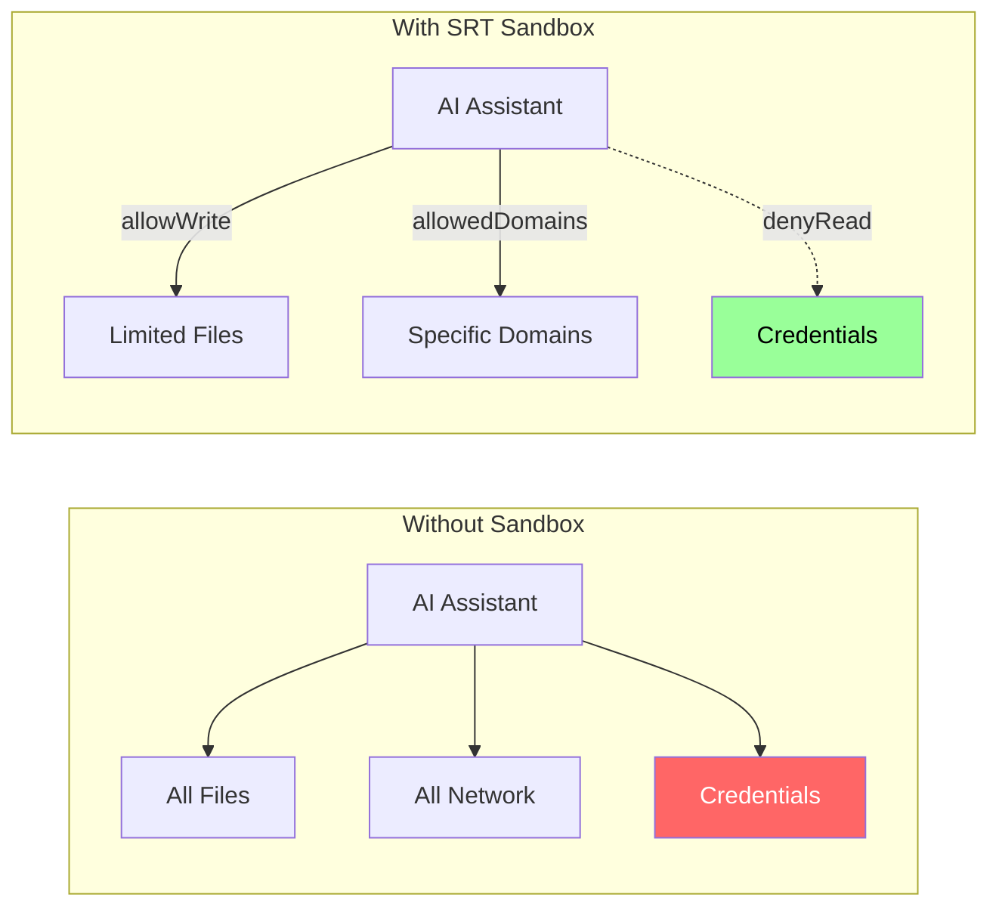

# Why Sandbox OpenClaw?

The reasoning behind running AI assistants in sandboxes.

## Visual Summary

---

## The Problem

AI assistants that can execute code face a trust asymmetry:

| Capability | Risk |
|------------|------|
| Shell access | Arbitrary command execution |
| File access | Credential theft, config modification |
| Network access | Data exfiltration, C2 communication |

OpenClaw specifically can:
- Run shell commands on your behalf
- Access your filesystem
- Make network requests to external services
- Modify system configurations

Without sandboxing, a compromised model (or prompt injection) could:
1. Read `~/.ssh/id_rsa` and exfiltrate via allowed domain
2. Modify `~/.bashrc` to persist a backdoor
3. Access cloud credentials from `~/.aws/credentials`

---

## Why SRT?

Anthropic's Sandbox Runtime provides:

1. **OS-level enforcement**: Uses `sandbox-exec` (macOS) or `bubblewrap` (Linux) for kernel-enforced restrictions
2. **Domain-level network filtering**: Proxy-based filtering allows domain wildcards
3. **Configurable policies**: JSON config for filesystem and network rules
4. **Defense in depth**: Multiple layers, not single point of control

### Alternative Approaches

| Approach | Limitation |
|----------|------------|
| Docker | Heavyweight, not designed for desktop |
| VM | Even heavier, poor UX |
| Manual iptables | IP-based, not domain-based |
| Application-level filtering | Can be bypassed |

SRT provides the right balance: lightweight, domain-aware, kernel-enforced.

---

## The `--` Separator Discovery

The critical gotcha in this plugin was discovered through structured debugging:

**Symptom**: All network requests blocked despite correct `allowedDomains`.

**Investigation**: Wolf agent identified that Commander.js (SRT's CLI parser) was consuming flags intended for the wrapped command.

**Root cause**: `srt --settings config.json curl -s https://...` interprets `-s` as `--settings`.

**Fix**: POSIX `--` separator: `srt --settings config.json -- curl -s https://...`

This is documented in [gotchas.md](../../skills/openclaw-srt-setup/references/gotchas.md).

---

## Security Model Rationale

### Why These Paths Are Protected

| Path | Threat | Consequence if Exposed |
|------|--------|------------------------|
| `~/.ssh` | Key theft | Server access, git push as you |
| `~/.aws` | Credential theft | Cloud infrastructure compromise |
| `~/.gnupg` | Key theft | Signing, encryption compromise |
| `~/.bashrc` | Persistence | Backdoor survives restarts |

### Why Network Filtering is Proxy-Based

`sandbox-exec` network rules are IP-based. For domain-level filtering:
- DNS resolution is dynamic (IPs change)
- Wildcards (`*.example.com`) are domain concepts
- CDNs serve multiple domains from same IPs

Proxy filtering solves this by inspecting the Host header / SNI.

---

## Design Principles

### Pit of Success

The patch script automatically adds `--` separator. Users don't need to remember.

### Minimal Allowlist

Default templates include only necessary domains. Users add what they need.

### Transparency

Architecture documentation explains HOW sandboxing works, not just WHAT to do.

### Recovery Path

After upgrades, re-running `patch-plist.py` restores sandboxing. Clear instructions in "After Upgrades" section.

---

## Limitations

What SRT does NOT protect against:

| Limitation | Why |
|------------|-----|
| Apps ignoring `HTTP_PROXY` | Some apps use raw sockets |
| Kernel exploits | Requires OS patching |
| Config tampering | If attacker can write to `~/.srt-settings.json` |
| Side-channel attacks | Beyond application-level sandboxing |

These are documented honestly in security-model.md.
